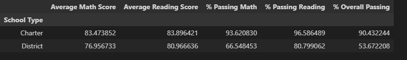

### Pandas Challenge
# Bootcamp Challenge No 4

This repository contains:

This file with the conclusions of the analysis.

The folder PyCitySchools. 
    Inside of this you will find:

1. The folder Resources, which includes:
    -The files students_complete.csv and schools_complete.csv, data sources for the excercise.

2.  The file PyCityschoolsfinal.jnpy with the code to run.

 

### PYCITY SCHOOLS ANALYSIS

## Background

As the new Chief Data Scientists for this school district, we will help the school board to make strategic decisions regarding future school budgets and priorities.
As a first task, we are asked to analyze the district-wide standardized test results. For this, we would have to aggregate the data to showcase obvious trends in school performance.

## Summary
The analyzed District serves a population of 39,170 students with a total budget of $24,649,428 shared by 15 schools. The schools are divided between Districts (7 schools) and Charters (8 schools). 
This district performance is reasonable with average scores of 78.99 and 81.88 for math and reading and passing rates of 74.98% and 85.81%, respectively. However, the overall passing rate for the students is just   65.17%.

## Results
The first thing we found is that the difference in the number of students in each school format stands out as the first type (public schools) serves almost double the number of kids of the second: district schools have an average population of 3,854 students, while Charters serve around 1,525 pupils each). 

In general charter schools count with smaller budgets than public high schools, fact that translate to smaller budgets per capita regardless the fewer high schoolers attending Charters. However, charter students show a better performance than those in public schools, both in scores and passing rates. 

Looking at the table below it is clear the inverse relations between the number of students and their performance. What is more, scores and passing rates show an inverse relation compared against the budget per capita of the school as well. In consequence, Charters, which are schools with lower number of students and smaller budgets per capita perform better than the regular public schools.

Going deeper the highest performers are consistently charter schools. Comparing the four highest performing schools against the four lowest performing is easy to see that the most successful schools deliver -in average- score results 6.48 and 2.94 points (in math and reading, respectively) above the lowest performing in the District.   

Even when comparing the scores by years charter schools deliver better results in in each grade (9th through 12th). In special, the difference in grades between the two groups is greater in mathematics than in reading.

Lastly, we note the trend we have seen (Charters performing better than public schools) are consistent every time. Based in the school spending of each we see medium and small budget schools deliver much better results than larger schools, and the same holds for number of students. In fact, the only big school where students have high scores and passing rates is Wilson High School, which is the biggest charter in the District.   

 

## Conclusions
- Schools with small and medium budgets deliver better results than the bigger ones. 
-  Schools with less students perform better than those highly populated. 
- The same applies to schools where the budget per capita is smaller (they show better results).
- The schools mentioned above are all charter schools, which signals the better performance regardless of the constrictions on budget. The only highly populated and funded school with great results is also a charter school.
- In summary it seems that is the charter school model which delivers better results than the public-school ones. Further analysis needs to be done to see what factors in the model (autonomy of plans, discipline policies, competitiveness, etc.) have the bigger impact on the test results. 

